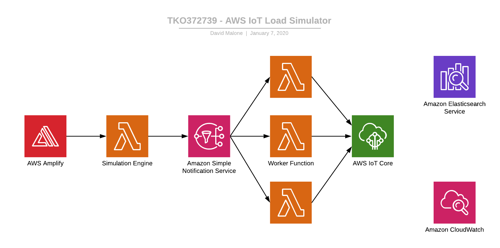

# aws-iot-loadsimulator

A Golang based client simulator for AWS IoT Core intended to be run on Lambda.

Basic architecture:



The source for each of these resides under [cmd/lambda](cmd/lambda).

## Project Dependencies

* Golang 1.12
* AWS Account
* [AWS CLI](https://docs.aws.amazon.com/cli/latest/userguide/cli-chap-install.html)
* [SAM CLI](https://docs.aws.amazon.com/serverless-application-model/latest/developerguide/serverless-sam-cli-install.html)
* [Amplify CLI](https://aws-amplify.github.io/docs/cli-toolchain/quickstart#installation)

This project uses [Go Modules](https://blog.golang.org/using-go-modules) and is structured according to https://github.com/golang-standards/project-layout


## Relevant AWS Limits

Service | Resource | Limit | Adjustable
--- | --- | --- | ---
AWS IoT Core | Maximum concurrent client connections per account | 500,000 | Yes
AWS IoT Core | Connect requests per second per account | 500 | Yes
AWS IoT Core | Inbound publish requests per second per account | 20,000 | Yes
AWS IoT Core | Message size | 128 KB | No
AWS IoT Rules Engine | Inbound publish requests per second per account | 20,000 | Yes
AWS Lambda | Concurrent executions | 1,000 | Yes
AWS Lambda | Function timeout | 900 seconds (15 minutes) | No
AWS Lambda | File descriptors | 1,024 | No
AWS Lambda | Execution processes/threads | 1,024 | No
Amazon SNS | Publish (US East Region) | 30,000 per second | Yes

* https://docs.aws.amazon.com/iot/latest/developerguide/limits-iot.html
* https://docs.aws.amazon.com/lambda/latest/dg/limits.html
* https://docs.aws.amazon.com/general/latest/gr/sns.html#limits_sns

## AWS IoT Resource Initialization

When building and deploying the project to your AWS account using `./scripts/deploy-sam.sh`, the script will automatically execute this function for you, but if you're running the CLI tools locally, you may need to run this first

```bash
./scripts/create-iot-thing.sh golang_thing
```

## Local Build & Test with CLI Interfaces

Local CLI interfaces were built to allow for testing of the common underlying simulation engine and worker components on your own hardware.

Simulation Engine:

```bash
go run cmd/cli/engine/main.go \
  -sns-topic-arn arn:aws:sns:us-east-1:xxxxxxxxxxxx:iot_simulator_notifications
```

Simulation Worker:

```bash
#Obtain the AWS IoT Core Endpoint address
MQTT_HOST=$(aws --output text iot describe-endpoint --endpoint-type iot:Data-ATS --query 'endpointAddress')

go run cmd/cli/worker/main.go \
  -host $MQTT_HOST \
  -max-clients 10 \
  -seconds-between-sns-messages 10 \
  -total-messages-per-client 5
```

Device Registry:

```bash
go run cmd/cli/registry/main.go \
  -mode init \
  -total-things 1000
```

## Deploy Simulator Lambda Functions

One script to rule them all...

```bash
./scripts/deploy-sam.sh
```

## Deploy Amplify Project Resources, Run Test UI locally

```bash
cd web
amplify init --yes
amplify pull --yes
amplify run
```

After your project is initialized, you will need to use the built-in self-service user registration form to create yourself a user, and then login to run the simulation engine. 

## Cleanup

```bash
aws cloudformation delete-stack --stack-name aws-iot-loadsimulator
```

## Backlog

Really Want for demo:
* ~~Aggregate Log messages in ElasticSearch?~~
* ~~Add CW Metric Dashboards into CW templates~~
* ~~Build simple UI to kick off device simulation, view device simulation stats~~
* ~~Could rely on [AWS IoT Lifecycle Events](https://docs.aws.amazon.com/iot/latest/developerguide/life-cycle-events.html) to get fleet online / offline state, but would need to offload to something that can handle atomic update requests - i.e. Redis~~
* Demonstrate blue/green deployment change to a Rule
* Measuring latency across the hops
* "Injectable" message payload
* ~~Externalize configuration in cmd/cli/lambda/worker/main.go~~
* Aaron's work to measure p99s, analyze performance data in Athena
* Figure out why the Paho MQTT client returns nondescript error message when being throttled
* ~~View relevant Service Limits in UI~~
* ~~Highlight which service limits will be hit due to simulator inputs~~


Nice to haves:
* Embed CW Metrics dashboard in UI?
* Anything interesting to show in DD?
* As part of the demo, can we illustrate the use of Fine-Grained Logging on a select group of things? https://docs.aws.amazon.com/iot/latest/developerguide/cloud-watch-logs.html#configure-logging
* Multiple message types with their own publishing scheduling

Lessons Learned:
* Can't use fleet indexing metrics without things being registered in the device registry
* Current issue with populating device registry is the max rate at which we can call CreateThing (default 15 TPS); this makes populating the device registry for large scale simulations potentially lengthy (100,000 items created using CreateThing at that rate would take about 1.85 hours to complete).
* Aaron's story about using ECS instead (also add some points to the presentation)
* Device Defender limits
* Lambda limits in total across the AWS account
